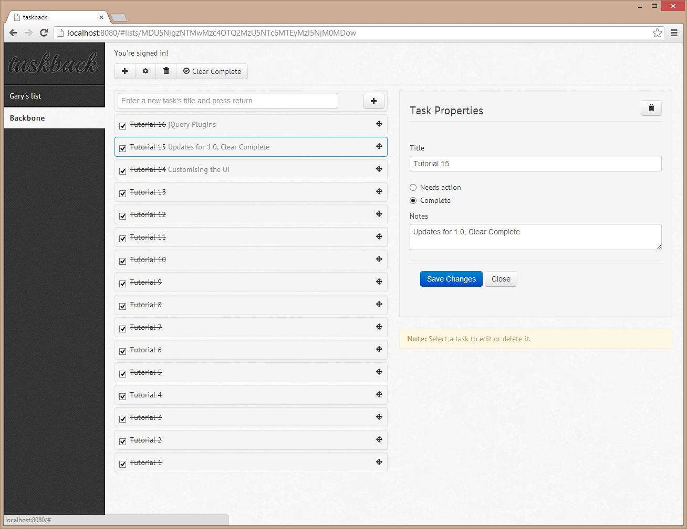

taskback v0.0.1
===============
My trip down the backbone rabbit hole following <http://dailyjs.com/2012/11/29/backbone-tutorial-1/>

Instructions
------------
 - Install using node package manager: `npm install`
 - Build using grunt: `npm build`
 - Startup the app: `npm start`

I've added config.js to the git ignore file to keep my API key private.

Preview
-------

